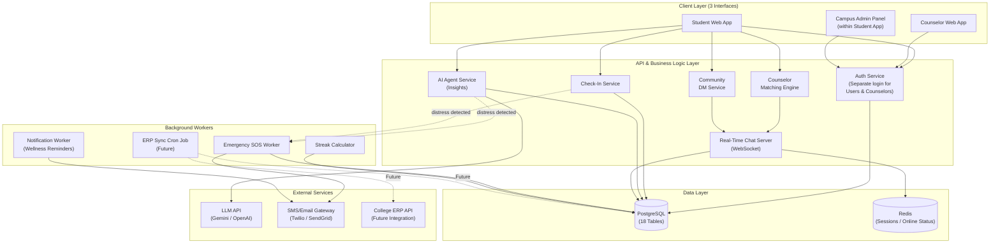
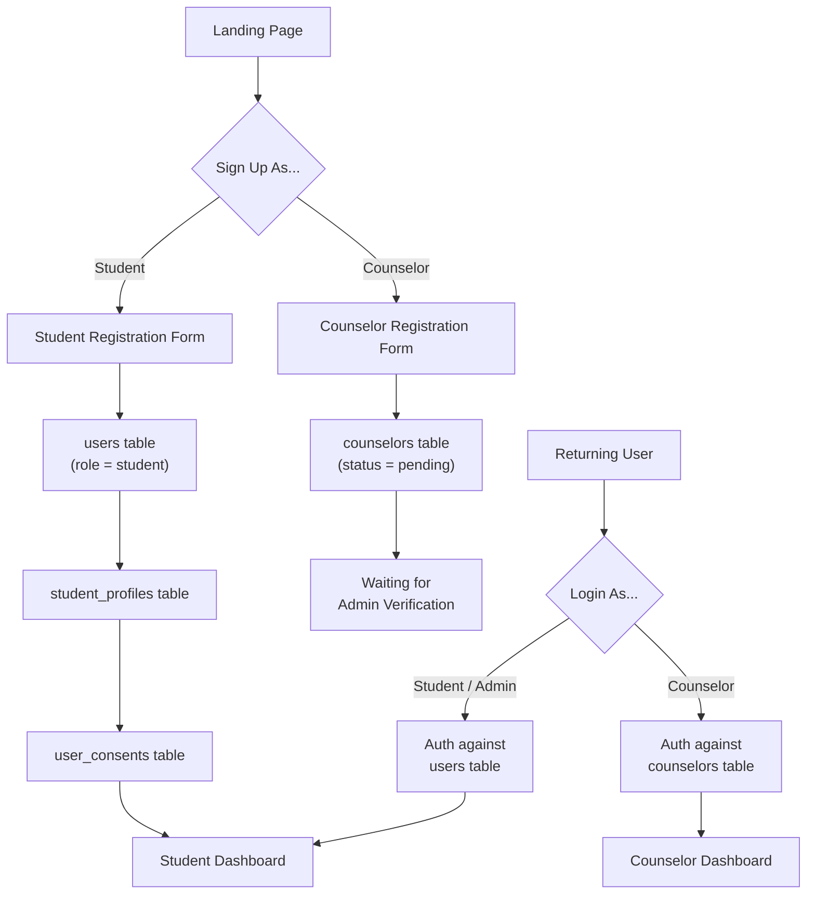
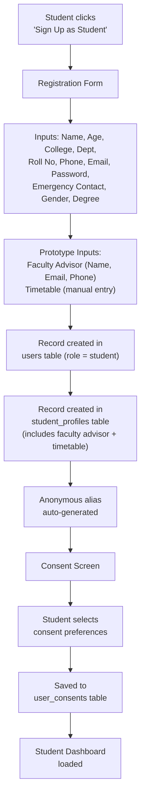
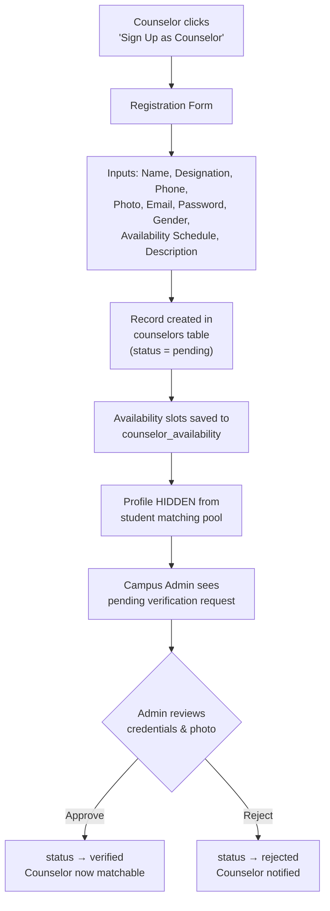
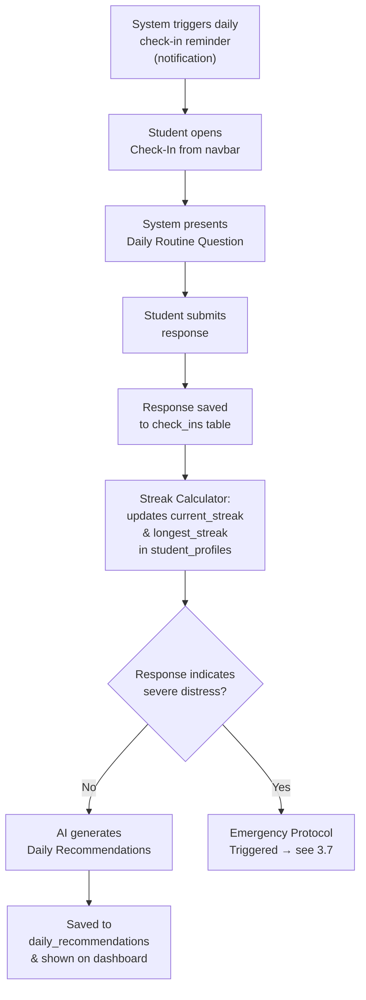
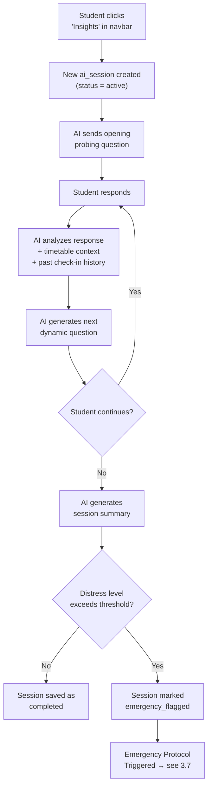
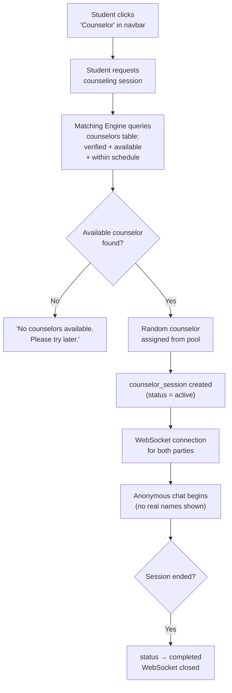
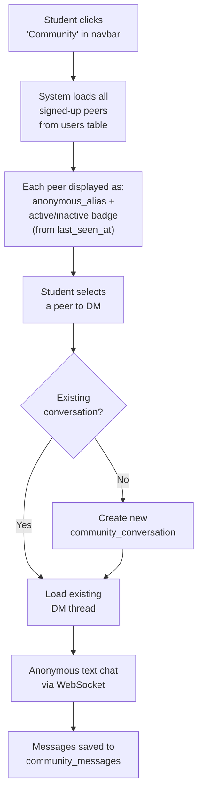
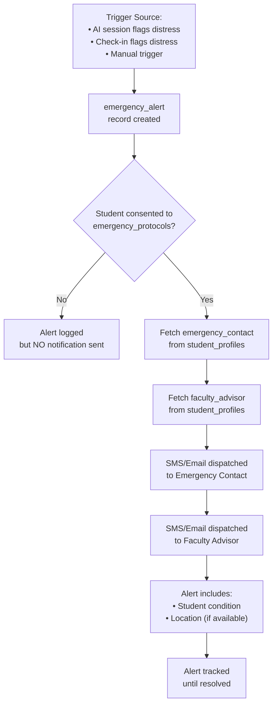
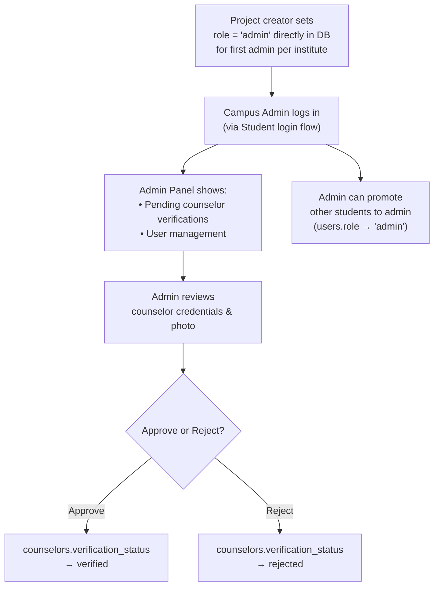

# TwinSync — Workflow Architecture (v2)

This document outlines the complete system workflow, reflecting the two-entity auth model (Users + Counselors) and the prototype-first approach.

---

## 1. System Architecture Overview



---

## 2. Authentication Architecture

Since `users` and `counselors` are separate tables, authentication is handled with two distinct flows:



---

## 3. User Journey Workflows

### 3.1 Student Registration & Onboarding



---

### 3.2 Counselor Registration & Verification



---

### 3.3 Daily Check-In Flow



---

### 3.4 AI Insights Session Flow



---

### 3.5 Counselor Matching & Chat Flow



---

### 3.6 Community Anonymous DM Flow



---

### 3.7 Emergency Protocol Flow



---

### 3.8 Campus Admin Workflow



---

## 4. Data Flow Summary

```
┌──────────────────────────────────────────────────────────────────┐
│                        CLIENT LAYER                              │
│  ┌─────────────┐    ┌─────────────────┐    ┌──────────────┐     │
│  │  Student App │    │  Counselor App  │    │  Admin Panel │     │
│  └──────┬──────┘    └───────┬─────────┘    └──────┬───────┘     │
└─────────┼───────────────────┼──────────────────────┼─────────────┘
          │                   │                      │
          ▼                   ▼                      ▼
┌──────────────────────────────────────────────────────────────────┐
│                     API LAYER (Backend)                           │
│                                                                  │
│  Auth ─── Check-In ─── AI Agent ─── Matching ─── Chat (WS)     │
│                                                                  │
└────────┬─────────────────┬──────────────────┬────────────────────┘
         │                 │                  │
         ▼                 ▼                  ▼
┌──────────────┐   ┌──────────────┐   ┌──────────────────┐
│  PostgreSQL  │   │   LLM API    │   │  SMS/Email       │
│  (18 Tables) │   │  (Gemini /   │   │  (Twilio /       │
│              │   │   OpenAI)    │   │   SendGrid)      │
└──────────────┘   └──────────────┘   └──────────────────┘
                                             ▲
                                             │
                                      ┌──────┴───────┐
                                      │  Background  │
                                      │  Workers     │
                                      │  (SOS,       │
                                      │   Streaks,   │
                                      │   Reminders) │
                                      └──────────────┘
```
